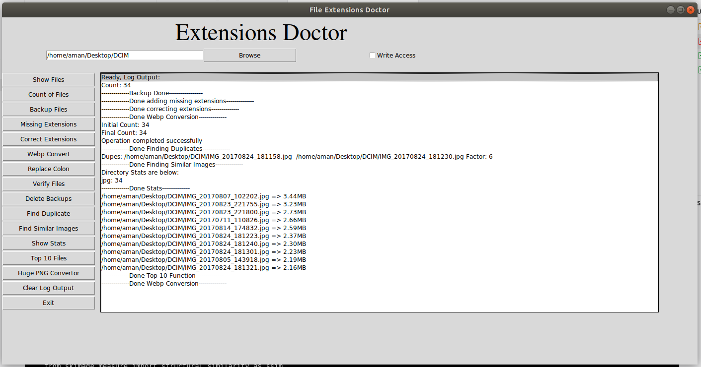

I have created this tool to make life easy when managing huge collection of images downloaded from Internet.
This application will work in both Linux & Windows under Python 3 environment.

Features:
- Count of Files
- Backup Files
- Missing Extensions
- Correct Extensions
- Webp Convert
- Replace Colon
- Verify Files
- Delete Backups
- Find Duplicate
- Find Similar Images
- Show Stats
- Top 10 Files
- Huge PNG Convertor

Requirements:
- Python3, Tkinter
- Sys, Glob, OS, RE
- Tarfile, Subprocess
- Imghdr, Shutil
- Pathlib, Itertools
- Collections, PIL
- Hashlib, Imagehash

Pending Tasks:
- Taskbar Icon in file
- If Ext == JPEG, rename to JPG
- Feature to append name_(1) in name if file exists
- Option to Remove other special characters , ! ? #
- Audio alert after long operation/Status bar red icon when Busy
- Stats fn - Sort results
- Search function different slash: if not (img == x[i]) in Windows only:
 D:/Files/Test/SmokyMountainCabinsWithViewsLarge.jpeg
 D:/Files/Test\SmokyMountainCabinsWithViewsLarge.jpeg
